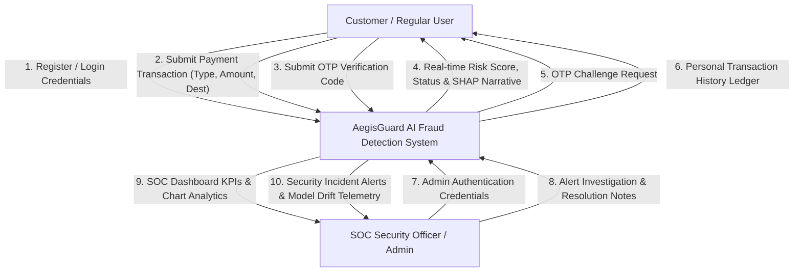
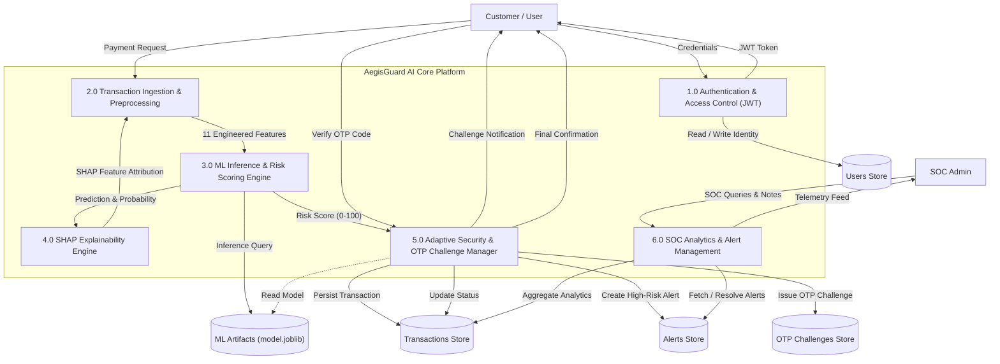
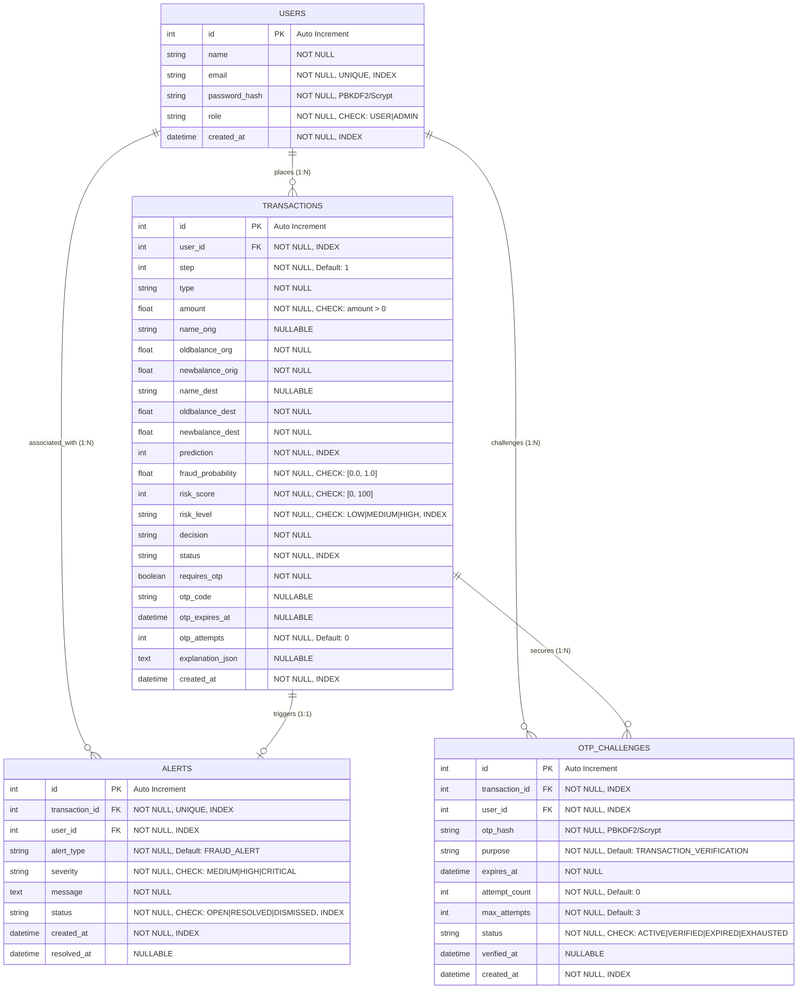
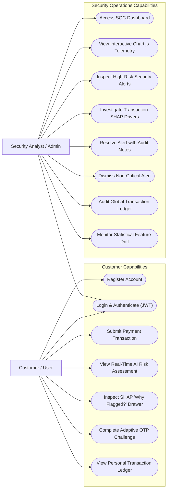
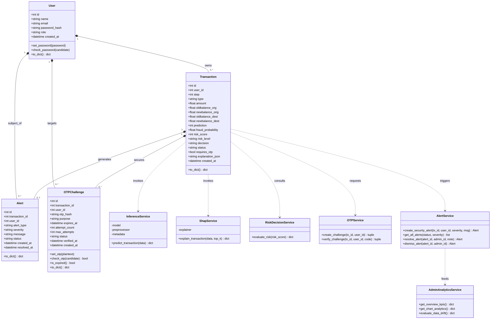
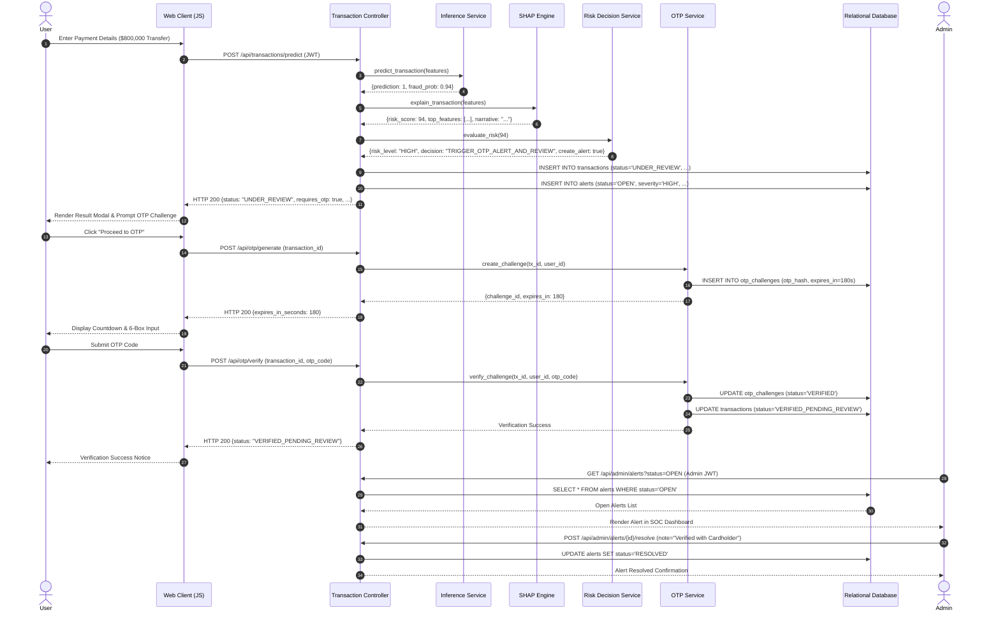
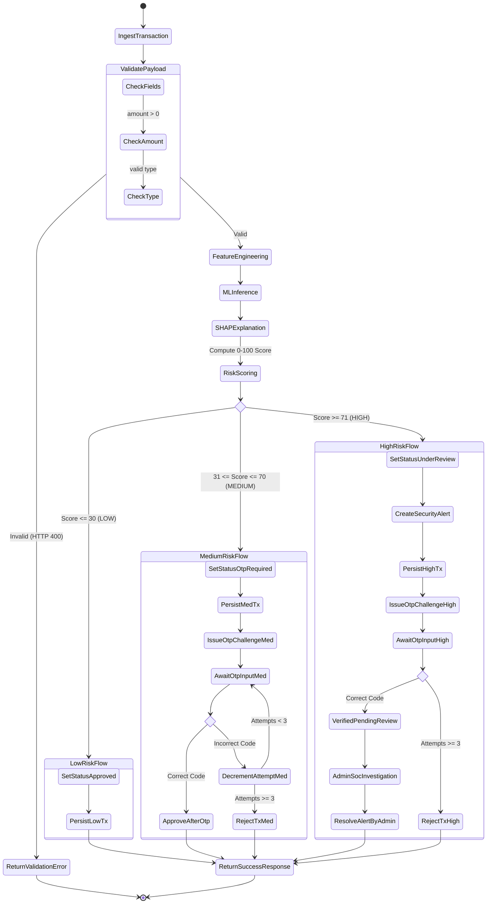

# Formal System Diagrams (DFD, ERD, UML)

**Project Title**: AI-Powered Real-Time Online Payment Fraud Detection and Explainable Risk Assessment System  
**System Name**: AegisGuard AI  
**Document Version**: 1.0.0  
**Date**: 2026-08-18  

---

## 1. Data Flow Diagrams (DFD)

### 1.1 DFD Level 0 — Context Diagram

---

### 1.2 DFD Level 1 — Subsystem Data Flow Diagram

---

### 1.3 DFD Level 2 — ML Inference & Security Workflow

```mermaid
graph TD
    RawTx["Raw Transaction Payload: (Type, Amount, Destination, Balances)"]
    
    subgraph "Feature Engineering & Preprocessing"
        F1["Calculate errorBalanceOrig = oldbalanceOrg - newbalanceOrig - amount"]
        F2["Calculate errorBalanceDest = oldbalanceDest + amount - newbalanceDest"]
        F3["Calculate amount_to_oldbalance_orig_ratio with division-by-zero protection"]
        F4["Calculate amount_to_oldbalance_dest_ratio"]
        F5["Extract hourOfDay = step % 24"]
        F6["Detect is_merchant_dest = (nameDest starts with 'M')"]
        F7["Exclude Leakage: isFraud, isFlaggedFraud, nameOrig, nameDest, raw step"]
        F8["OneHotEncode Categorical Type via ColumnTransformer"]
    end
    
    RawTx --> F1 & F2 & F3 & F4 & F5 & F6
    F1 & F2 & F3 & F4 & F5 & F6 --> F7 --> F8
    
    subgraph "Machine Learning & XAI"
        M1["RandomForestClassifier.predict_proba(X_transformed)"]
        M2["Compute Fraud Probability P(fraud)"]
        M3["Compute Risk Score = round(P(fraud) * 100)"]
        M4["shap.TreeExplainer.shap_values(X_transformed)"]
        M5["Map Transformed Indices to Human-Readable Names"]
        M6["Synthesize Natural Language Risk Summary Narrative"]
    end
    
    F8 --> M1
    M1 --> M2 --> M3
    F8 --> M4
    M4 --> M5 --> M6
    
    subgraph "3-Tier Adaptive Security Routing"
        R1{"Risk Score Band?"}
        T1["0 – 30 (LOW RISK): Status APPROVED, APPROVE_IMMEDIATELY"]
        T2["31 – 70 (MEDIUM RISK): Status OTP_REQUIRED, Generate OTP Challenge"]
        T3["71 – 100 (HIGH RISK): Status UNDER_REVIEW, Generate Security Alert + OTP Challenge"]
    end
    
    M3 --> R1
    R1 -->|"Score <= 30"| T1
    R1 -->|"31 <= Score <= 70"| T2
    R1 -->|"Score >= 71"| T3
```

---

## 2. Entity Relationship Diagram (ERD)

---

## 3. Unified Modeling Language (UML) Diagrams

### 3.1 UML Use Case Diagram

---

### 3.2 UML Class Diagram

---

### 3.3 UML Sequence Diagram — Complete Transaction Lifecycle

---

### 3.4 UML Activity Diagram — Adaptive 3-Tier Security Workflow

