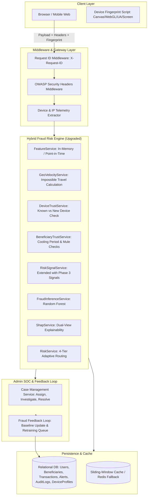

# Phase 3 Implementation Plan: Enterprise Security Hardening & SOC Intelligence

**Project Title**: AI-Powered Real-Time Online Payment Fraud Detection and Explainable Risk Assessment System  
**System Name**: FraudShield AI  
**Document Version**: 1.0.0  
**Date**: 2026-08-19  
**Status**: DRAFT — PENDING ARCHITECTURAL APPROVAL  

---

## 1. Executive Objectives

Phase 3 transforms FraudShield AI into an **enterprise-grade, placement-winning financial cybersecurity platform** by implementing:
1. **Device Fingerprinting & Client Telemetry**: Detecting unrecognized devices and browser anomalies.
2. **Account Takeover (ATO) & Impossible Travel Detection**: Geolocation velocity intelligence.
3. **Beneficiary Risk Intelligence & Cooling Period Rules**: Protecting accounts against rapid drain through new payees.
4. **Human-in-the-Loop SOC Case Management & Fraud Feedback Loop**: Multi-analyst case triage that dynamically retrains risk baselines.
5. **High-Performance In-Memory Sliding-Window Velocity Engine**: $O(1)$ sub-millisecond velocity aggregation.
6. **Production Observability, Security Headers & Containerization**: Structured JSON audit trails, correlation IDs (`X-Request-ID`), OWASP security headers, Docker/Compose, and CI/CD automation.

---

## 2. Problems Being Solved

| Problem in Current System | Real-World Attack Scenario | Phase 3 Solution |
| :--- | :--- | :--- |
| **No Device Context** | Attacker obtains stolen password and logs in from a brand new device/IP; system evaluates it normally. | Client telemetry generates device fingerprint; new device triggers mandatory step-up authentication. |
| **No Geolocation Velocity** | Account used in Mumbai at 14:00 and in London at 14:15. | Geolocation engine detects "Impossible Travel" ($>800\text{ km/h}$) and elevates risk to `CRITICAL`. |
| **Mule Account Exploitation** | Fraudster adds a mule UPI handle and immediately initiates a high-value transfer to drain funds. | Beneficiary 24-hour cooling period limits immediate high-value transfers to newly added recipients. |
| **Isolated Admin Resolutions** | Admin marks transaction as confirmed fraud, but the model/system history does not update. | Automated Fraud Feedback Loop updates customer fraud frequency and queues sample for ML active learning. |
| **Database Contention on Velocity** | SQL `COUNT()` / `SUM()` over past 1m/10m queries create primary DB lock contention under high TPS. | Sliding-window cache stores timestamped transaction amounts for $O(1)$ sub-millisecond retrieval. |
| **Missing Compliance Auditing** | Security audits (PCI-DSS / RBI Digital Payment Guidelines) require structured immutable request logs. | Request middleware injects `X-Request-ID` and outputs structured JSON audit records for all security events. |

---

## 3. Prioritized Feature Breakdown

```
+----------------------------------------------------------------------------------------------------+
|                                    PHASE 3 PRIORITY MATRIX                                         |
+----------------------------------------------------------------------------------------------------+
| [P0 - CRITICAL CORE]                                                                               |
|   1. Device Fingerprinting & Unknown Device Risk Signal                                            |
|   2. Geolocation Intelligence & Impossible-Travel Anomaly Detection                                |
|   3. Beneficiary 24-Hour Cooling Period & Mule Relationship Risk Signal                            |
|   4. Human-in-the-Loop SOC Case Management & Closed-Loop Fraud Feedback                            |
|   5. OWASP Security Headers Middleware & Structured JSON Audit Trail (`X-Request-ID`)              |
+----------------------------------------------------------------------------------------------------+
| [P1 - HIGH VALUE PLATFORM ENHANCEMENTS]                                                            |
|   6. High-Performance Sliding-Window In-Memory Velocity Engine                                     |
|   7. Dynamic Beneficiary Risk Scoring & Relationship Network Analysis                              |
|   8. Production Dockerization (`Dockerfile`, `docker-compose.yml` with Flask, MySQL, Redis)        |
|   9. Automated GitHub Actions CI/CD Pipeline (Lint, Security Scan, 199+ Tests)                     |
+----------------------------------------------------------------------------------------------------+
| [P2 - NICE-TO-HAVE / POLISH]                                                                       |
|   10. Continuous PSI / Kolmogorov-Smirnov Feature Drift Alerting in SOC                             |
|   11. Real-Time Webhook Simulator for External Banking System Alerts                               |
+----------------------------------------------------------------------------------------------------+
```

---

## 4. Proposed Architecture & Component Design



---

## 5. Explicit Architectural Categorization

### A. What is Already Production-Quality (Do NOT Break)
- Core Hybrid Fraud Risk Engine combining Random Forest with 12 domain signals and Indian banking thresholds.
- Point-in-Time leakage prevention ($t < t_{\text{tx}}$) in feature extraction.
- Dual-View SHAP explainability architecture (Customer safe plain text vs SOC Game-Theoretic attributions).
- Secure Password Reset with SHA-256 hashing, anti-enumeration identical responses, attempt lockout, and throttling.
- Simulated Financial Ledger with atomic balance deductions and non-negative constraints.
- Complete 4-tier decision matrix (`LOW`, `MEDIUM`, `HIGH`, `CRITICAL`).

### B. What is Currently Demo-Quality
- Unstructured console logging (to be replaced with RFC 5424 structured JSON logging).
- Single-step alert resolution (to be upgraded to multi-state case management).
- Raw WSGI execution (to be enhanced with Docker and Gunicorn configuration).

### C. What is Missing Before True Enterprise Deployment
- Device fingerprinting and client telemetry.
- Geolocation distance/velocity anomaly detection.
- Beneficiary cooling-period safety policy.
- Automated closed-loop fraud feedback mechanism.
- OWASP security headers (`CSP`, `HSTS`, `X-Frame-Options`, `X-Content-Type-Options`).

### D. What Should NOT Be Changed
- The trained Random Forest model artifact (`model.joblib`) and preprocessor (`preprocessor.joblib`).
- The 4 risk tier numerical boundaries (`0-29`, `30-59`, `60-79`, `80-100`).
- The existing authentication and JWT verification mechanics.
- The 199 existing automated test assertions.

### E. What Should Be Implemented in Phase 3
1. Device Profile model & Device Fingerprinting telemetry.
2. IP & Geolocation parser with Impossible-Travel velocity checks.
3. Beneficiary 24-Hour Cooling Period & Mule Account detection.
4. SOC Case Management lifecycle (`OPEN`, `INVESTIGATING`, `CONFIRMED_FRAUD`, `FALSE_POSITIVE`, `RESOLVED`) with analyst assignment and notes.
5. Automated Fraud Feedback Loop updating customer baselines and retraining queues.
6. Sliding-window in-memory velocity cache helper.
7. OWASP security headers and structured JSON request correlation middleware (`X-Request-ID`).
8. Production Dockerization (`Dockerfile`, `docker-compose.yml`) and GitHub Actions CI workflow.

### F. What Should Be Postponed to Phase 4
- Graph Neural Network (GNN) entity resolution for complex multi-hop syndicates.
- Native mobile SDK (Android/iOS) biometric integrations.
- Distributed Kafka event-streaming ingestion cluster.
- Hardware Security Module (HSM) key management integration.

---

## 6. Detailed Component Specifications

### 6.1 New Database Models

#### 1. `DeviceProfile` (`app/models/device_profile.py`)
- `id`: `INTEGER PRIMARY KEY AUTOINCREMENT`
- `user_id`: `INTEGER NOT NULL FK(users.id)`
- `device_hash`: `VARCHAR(64) NOT NULL INDEX` (SHA-256 hash of canvas, WebGL, user-agent, screen)
- `device_name`: `VARCHAR(100)` (e.g. "Chrome 128 on Windows 11")
- `first_seen_at`: `DATETIME NOT NULL`
- `last_seen_at`: `DATETIME NOT NULL`
- `trust_score`: `FLOAT DEFAULT 1.0` (0.0 to 1.0)
- `is_blocked`: `BOOLEAN DEFAULT FALSE`

#### 2. `AuditLog` (`app/models/audit_log.py`)
- `id`: `INTEGER PRIMARY KEY AUTOINCREMENT`
- `request_id`: `VARCHAR(36) NOT NULL INDEX` (UUIDv4)
- `user_id`: `INTEGER NULL FK(users.id)`
- `event_type`: `VARCHAR(50) NOT NULL INDEX` (e.g. `LOGIN_ATTEMPT`, `TRANSACTION_EVALUATED`, `OTP_VERIFIED`, `ALERT_TRIAGED`)
- `severity`: `VARCHAR(20) NOT NULL` (`INFO`, `WARN`, `CRITICAL`)
- `ip_address`: `VARCHAR(45)`
- `device_hash`: `VARCHAR(64)`
- `details`: `JSON`
- `created_at`: `DATETIME NOT NULL INDEX`

#### 3. `CaseInvestigation` (`app/models/case_investigation.py`)
- `id`: `INTEGER PRIMARY KEY AUTOINCREMENT`
- `alert_id`: `INTEGER NOT NULL FK(alerts.id)`
- `analyst_id`: `INTEGER NOT NULL FK(users.id)`
- `case_status`: `VARCHAR(30) NOT NULL` (`INVESTIGATING`, `CONFIRMED_FRAUD`, `FALSE_POSITIVE`, `RESOLVED`)
- `fraud_category`: `VARCHAR(50)` (e.g. `ACCOUNT_TAKEOVER`, `MULE_TRANSFER`, `CREDENTIAL_STUFFING`)
- `resolution_notes`: `TEXT`
- `action_taken`: `VARCHAR(50)` (e.g. `ACCOUNT_FROZEN`, `TRANSACTION_BLOCKED`, `ALERT_DISMISSED`)
- `created_at`: `DATETIME NOT NULL`
- `updated_at`: `DATETIME NOT NULL`

---

### 6.2 Extended Risk Signals

| Signal Code | Category | Condition | Risk Increment | Hard Floor |
| :--- | :--- | :--- | :---: | :---: |
| `UNKNOWN_DEVICE_LOGIN` | Device | Device hash not recognized for user account | $+25$ | 40 |
| `IMPOSSIBLE_TRAVEL_VELOCITY` | Geolocation | Geolocation distance / $\Delta t > 800\text{ km/h}$ | $+45$ | 80 (`CRITICAL`) |
| `BENEFICIARY_COOLING_PERIOD` | Beneficiary | Transfer $> ₹25,000$ to beneficiary added within $<24\text{ hours}$ | $+30$ | 60 (`HIGH`) |
| `MULE_ACCOUNT_RECIPIENT` | Beneficiary | Beneficiary received transfers from $\ge 3$ distinct users within 1 hour | $+40$ | 75 (`HIGH`) |
| `HIGH_FAILED_LOGIN_BURST` | Account Takeover | $\ge 3$ failed logins followed by immediate high-value transfer | $+35$ | 70 (`HIGH`) |

---

### 6.3 API Endpoint Additions & Updates

#### 1. Device Profile Management
- `GET /api/profile/devices`: List authenticated user's registered devices.
- `DELETE /api/profile/devices/<id>`: Revoke trust for a device.

#### 2. Enhanced Transaction Evaluation
- `POST /api/transactions/predict`:
  - Request headers: `X-Device-Fingerprint`, `X-Forwarded-For`, `X-Client-City`, `X-Client-Country`.
  - Telemetry integrated into `FeatureService` without breaking legacy contract.

#### 3. Advanced SOC Case Management
- `POST /api/admin/alerts/<id>/assign`: Assign alert to logged-in analyst.
- `POST /api/admin/alerts/<id>/investigate`: Update case status, record investigative notes, and trigger feedback loop.
- `GET /api/admin/audit-logs`: Query structured audit log events with filtering by date, user, event type, and severity.

---

### 6.4 Security & Infrastructure Hardening

1. **Security Headers Middleware**:
   ```python
   @app.after_request
   def add_security_headers(response):
       response.headers["X-Content-Type-Options"] = "nosniff"
       response.headers["X-Frame-Options"] = "DENY"
       response.headers["X-XSS-Protection"] = "1; mode=block"
       response.headers["Content-Security-Policy"] = "default-src 'self'; script-src 'self' 'unsafe-inline' https://cdn.jsdelivr.net; style-src 'self' 'unsafe-inline' https://fonts.googleapis.com; font-src 'self' https://fonts.gstatic.com;"
       response.headers["Strict-Transport-Security"] = "max-age=31536000; includeSubDomains"
       response.headers["Referrer-Policy"] = "strict-origin-when-cross-origin"
       return response
   ```
2. **Correlation ID Middleware**:
   - Injects `X-Request-ID` (UUIDv4) into Flask request context and includes it in all log records and JSON response headers.

---

## 7. Testing Strategy

1. **Unit Tests**:
   - Device fingerprint hashing and trust scoring.
   - Haversine distance and impossible-travel speed calculations.
   - Beneficiary cooling-period temporal window evaluation.
   - Multi-analyst case management status transitions.
   - Fraud feedback loop data updating.
2. **Integration Tests**:
   - End-to-end device recognition on login and payment.
   - Transaction elevation to `HIGH` when cooling period rule triggers.
   - Transaction elevation to `CRITICAL` when impossible travel is detected.
   - Audit trail persistence across all lifecycle operations.
3. **Regression Tests**:
   - Guarantees 100% pass rate on all existing **199 tests**.
   - Target Phase 3 test count: **$\ge 235$ tests**.

---

## 8. Definition of Done (DoD)

- [ ] All new database models (`DeviceProfile`, `AuditLog`, `CaseInvestigation`) migrated with non-breaking migrations.
- [ ] Device fingerprinting, Geolocation velocity, and Beneficiary cooling-period signals integrated into `RiskSignalService`.
- [ ] SOC Case Management workflow and closed-loop feedback service fully operational.
- [ ] OWASP security headers and structured correlation ID middleware active.
- [ ] Docker containerization and GitHub Actions CI workflow implemented.
- [ ] All 199 previous tests pass + $\ge 35$ new Phase 3 tests pass ($\ge 235$ tests passing total).
- [ ] `GET /api/health` returns `200 OK (Healthy)`.
- [ ] Documentation updated across `API_DOCUMENTATION.md`, `SRS.md`, and `LIVE_DEMO_RUNBOOK.md`.
