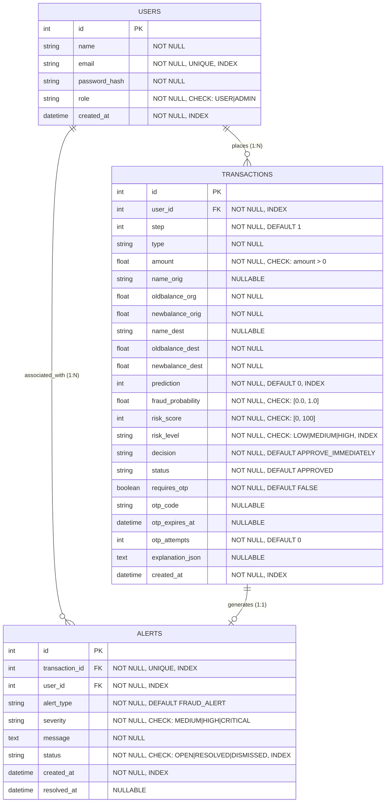

# Database Persistence & Schema Hardening Report

**Project**: AI-Powered Real-Time Online Payment Fraud Detection and Explainable Risk Assessment System  
**Phase**: Phase 8 — Database Persistence & Schema Hardening  
**Database**: MySQL (Production/Development) / SQLite (Testing/In-Memory)  
**ORM & Migration Tooling**: Flask-SQLAlchemy, Flask-Migrate (Alembic)  
**Report Date**: 2026-08-18  

---

## 1. Database Architecture & Entity Relationship Model

The relational persistence layer maintains 3 core entities:
1. `users`: System accounts with role-based permissions (`USER` vs `ADMIN`).
2. `transactions`: Financial payment requests with ML fraud assessments, risk scores, and OTP challenge states.
3. `alerts`: High-priority fraud incident records generated automatically for administrative investigation.



---

## 2. Table Definitions & Constraints

### A. `users` Table
| Column | Type | Nullable | Constraints & Indexes | Description |
|---|---|---|---|---|
| `id` | `INT` | No | `PRIMARY KEY`, `AUTO_INCREMENT` | Unique user account identifier |
| `name` | `VARCHAR(100)` | No | — | User's full name |
| `email` | `VARCHAR(120)` | No | `UNIQUE`, `INDEX ix_users_email` | User login email address |
| `password_hash` | `VARCHAR(255)` | No | — | Salted PBKDF2/Scrypt hash |
| `role` | `VARCHAR(20)` | No | `CHECK (role IN ('USER', 'ADMIN'))` | Role-based permission level |
| `created_at` | `DATETIME` | No | `INDEX ix_users_created_at` | Account creation timestamp |

### B. `transactions` Table
| Column | Type | Nullable | Constraints & Indexes | Description |
|---|---|---|---|---|
| `id` | `INT` | No | `PRIMARY KEY`, `AUTO_INCREMENT` | Unique transaction ID |
| `user_id` | `INT` | No | `FOREIGN KEY (users.id) ON DELETE CASCADE`, `INDEX` | Account owner |
| `step` | `INT` | No | Default `1` | Diurnal time simulation step |
| `type` | `VARCHAR(20)` | No | — | Payment type (`TRANSFER`, etc.) |
| `amount` | `FLOAT` | No | `CHECK (amount > 0)` | Payment monetary value |
| `name_orig` | `VARCHAR(50)` | Yes | — | Sender account identifier |
| `oldbalance_org` | `FLOAT` | No | — | Sender initial balance |
| `newbalance_orig` | `FLOAT` | No | — | Sender final balance |
| `name_dest` | `VARCHAR(50)` | Yes | — | Recipient account identifier |
| `oldbalance_dest`| `FLOAT` | No | — | Recipient initial balance |
| `newbalance_dest`| `FLOAT` | No | — | Recipient final balance |
| `prediction` | `INT` | No | `INDEX`, Default `0` | Binary prediction ($0$ or $1$) |
| `fraud_probability` | `FLOAT` | No | `CHECK (fraud_probability >= 0 AND <= 1)` | ML model estimated probability |
| `risk_score` | `INT` | No | `CHECK (risk_score >= 0 AND <= 100)` | Operational risk score |
| `risk_level` | `VARCHAR(20)` | No | `CHECK (risk_level IN ('LOW','MEDIUM','HIGH'))`, `INDEX` | Risk classification tier |
| `decision` | `VARCHAR(50)` | No | Default `'APPROVE_IMMEDIATELY'` | Decision action code |
| `status` | `VARCHAR(30)` | No | Default `'APPROVED'` | Transaction workflow status |
| `requires_otp` | `BOOLEAN` | No | Default `FALSE` | OTP challenge flag |
| `explanation_json` | `TEXT` | Yes | — | Serialized SHAP explanation audit |
| `created_at` | `DATETIME` | No | `INDEX`, Compound Index `(user_id, created_at)` | Submission timestamp |

### C. `alerts` Table
| Column | Type | Nullable | Constraints & Indexes | Description |
|---|---|---|---|---|
| `id` | `INT` | No | `PRIMARY KEY`, `AUTO_INCREMENT` | Unique alert ID |
| `transaction_id` | `INT` | No | `FOREIGN KEY (transactions.id) ON DELETE CASCADE`, `UNIQUE` | Triggering transaction |
| `user_id` | `INT` | No | `FOREIGN KEY (users.id) ON DELETE CASCADE`, `INDEX` | Account owner |
| `alert_type` | `VARCHAR(50)` | No | Default `'FRAUD_ALERT'` | Alert category |
| `severity` | `VARCHAR(20)` | No | `CHECK (severity IN ('MEDIUM','HIGH','CRITICAL'))` | Alert urgency level |
| `message` | `TEXT` | No | — | Detailed explanation narrative |
| `status` | `VARCHAR(20)` | No | `CHECK (status IN ('OPEN','RESOLVED','DISMISSED'))`, `INDEX` | Resolution state |
| `created_at` | `DATETIME` | No | `INDEX` | Alert timestamp |
| `resolved_at` | `DATETIME` | Yes | — | Resolution timestamp |

---

## 3. Migration Tooling & Seed Strategy

1. **Flask-Migrate / Alembic**:
   - Initialized migration repository in `migrations/`.
   - Created reproducible initial migration: `migrations/versions/001_initial_hardened_schema.py`.
2. **Database Initialization Tool**:
   - `database/init_db.py` allows non-destructive or clean schema initialization across environments.
3. **Idempotent Seed Script**:
   - `database/seed_db.py` creates default demo accounts:
     - `user@example.com` (`USER` role)
     - `admin@example.com` (`ADMIN` role)
   - Reads passwords from `DEMO_USER_PASSWORD` and `DEMO_ADMIN_PASSWORD` environment variables.
   - Idempotent: Executing repeatedly does not create duplicate entries or crash.

---

## 4. Security & Data Integrity Measures

1. **Password Hash Shielding**: `User.to_dict()` excludes `password_hash` from normal API serialization.
2. **No Hard-Coded Credentials**: Database URL and connection secrets are loaded via `.env` / `python-dotenv`.
3. **Rollback on Failure**: When an error occurs during payment processing, `db.session.rollback()` ensures no corrupted records remain.

---

## 5. Test Suite Execution & Results

Executed:
```bash
py -m pytest -v
```

**Coverage Summary**:
- Database table creation & schema inspection: **PASSED**
- Idempotent seed execution (0 duplicates created on re-run): **PASSED**
- Unique email constraint rejection: **PASSED**
- Role separation & password verification: **PASSED**
- Foreign key and relational navigation (`User -> Transaction -> Alert`): **PASSED**
- Cascade delete behavior on test cleanup: **PASSED**
- Database rollback safety: **PASSED**
"""

    report_path = DOCS_DIR / "database_schema_report.md"
    with open(report_path, "w", encoding="utf-8") as f:
        f.write(report_content)
    print(f"Saved database schema report to: {report_path}")


if __name__ == "__main__":
    pass
